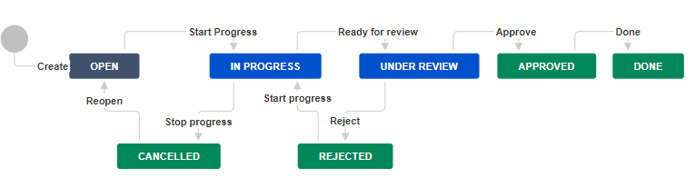

### example-groovy-script-in-workflow-transitions-conditions-validators-postfunctions.md

---

* Índice
  * [Pré-Requisitos](#1-pré-requisitos)
    * [Workflow, Statuses and Transitions](#11-workflow-statuses-and-transitions)
  * [Groovy Script Workflow Transitions Condition - Custom Field 1 deve estar preenchido com um CEP numérico de 8 posições numéricas](#2-groovy-script-workflow-transitions-condition---custom-field-1-deve-estar-preenchido-com-um-cep-numérico-de-8-posições-numéricas)
  * [Groovy Script Workflow Transitions Post Function - Custom Field 2 é preenchido automaticamente com o nome do logradouro correspondente ao CEP Custom Field 1](#3-groovy-script-workflow-transitions-post-function---custom-field-2-é-preenchido-automaticamente-com-o-nome-do-logradouro-correspondente-ao-cep-custom-field-1)


---

### 1. Pré-Requisitos

#### 1.1. Workflow, Statuses and Transitions



#### 1.2. Custom Fields

{| class="wikitable"
|+ Custom Fields
|-
! Name
! Type
! Screens
|-
| Custom Field 1
| Text Field (single line)
| DEMO: Process Management Create Issue Screen, DEMO: Process Management Edit/View Issue Screen, DEMO: Process Management Resolve Issue Screen, DEMO: Simple Issue Tracking Comment Screen
|-
| Custom Field 2
| Text Field (single line)
| DEMO: Process Management Create Issue Screen, DEMO: Process Management Edit/View Issue Screen, DEMO: Process Management Resolve Issue Screen, DEMO: Simple Issue Tracking Comment Screen
|-
| Custom Field 3
| Text Field (single line)
| DEMO: Process Management Create Issue Screen, DEMO: Process Management Edit/View Issue Screen, DEMO: Process Management Resolve Issue Screen, DEMO: Simple Issue Tracking Comment Screen
|-
| Custom Field 4
| Text Field (single line)
| DEMO: Process Management Create Issue Screen, DEMO: Process Management Edit/View Issue Screen, DEMO: Process Management Resolve Issue Screen, DEMO: Simple Issue Tracking Comment Screen
|}

---

### 2. Groovy Script Workflow Transitions Condition - Custom Field 1 deve estar preenchido com um CEP numérico de 8 posições numéricas

#### 2.1. Navegue até a configuração do Script Groovy

2.1. Navegue para a opção do menu principal superior do Jira `Configurações >> Jira Administration >> Issues`

2.2. Na página de `Administration` clique na aba de menu superior `Issues`, em seguida no menu lateral esquerdo `Workflow` e em seguida link `Actions :: Edit` na linha correspondente à configuração do workflow desejado

2.3. Na página `Adminsration >> Issues >> Workflows` clique no botão `Diagram` e no checkbox `Show transition labels` para visualizar o __Workflow Statuses Chart Transition Diagram__

2.4. Na página `Adminsration >> Issues >> Workflows` com o diagrama visível, clique na linha da transição `Start Progress` para acionar o menu suspenso de **Edição da transição**, em seguida clique no link `Conditions` para acessar a página de edição

2.5. Na página `Adminsration >> Issues >> Workflows >> [nome-do-workflow] (Draft)` clique no link `Conditions` e em seguida no botão `Add condition`

2.6. Na página `Adminsration >> Add Condition To Transition` escolha a opção clicando no botão `Script Condition [ScriptRunner]` e em seguida no botão `Add`

2.7. Na página `Adminsration >> Add Parameters To Condition` 
* Escolha a opção `Custom script condition`
  * Faça a atribuição à variável __boolean__ `passesCondition` para prevenir a tranisção

#### 2.2. Construa o Script Groovy com o comportamento desejado

* **Objetivo**: O campo `Custom Field 1` deve estar preenchido com um CEP numérico de 8 posições numéricas, caso contrário o __Workflow__ deverá impedir a transição `Start Progress`.
* **Como fazer**: 
  * Editar o campo `Script` com o código desejado
  * O resultado __boolean__ onde `true` é sucesso e `false` é fracasso é determinado por uma variável **`passesCondition`**
  * Clicar no botão `Update` para salvar o conteúdo de seu script
  * Clicar no botão `Publicar` para publicar a nova versão de seu workflow

* Script:

```groovy
// Import commons libraries
import com.atlassian.jira.component.ComponentAccessor

// Instance custom field
def issueManager = ComponentAccessor.getIssueManager()
def customFieldManager = ComponentAccessor.getCustomFieldManager()
def customField1 = customFieldManager.getCustomFieldObjectByName("Custom Field 1")
def customFieldValue1 = issue.getCustomFieldValue(customField1) as String

// Set the variable passesCondition to false to prevent the transition
passesCondition = false

// Check condition - 8 digits
if (customFieldValue1.length() == 8 ) {
    if (customFieldValue1.isNumber()) {
        // Passed
        passesCondition = true
    }
}
```


---

### 3. Groovy Script Workflow Transitions Post Function - Custom Field 2 é preenchido automaticamente com o nome do logradouro correspondente ao CEP Custom Field 1

#### 3.1. Navegue até a configuração do Script Groovy

3.1. Navegue para a opção do menu principal superior do Jira `Configurações >> Jira Administration >> Issues`

3.2. Na página de `Administration` clique na aba de menu superior `Issues`, em seguida no menu lateral esquerdo `Workflow` e em seguida link `Actions :: Edit` na linha correspondente à configuração do workflow desejado

3.3. Na página `Adminsration >> Issues >> Workflows` clique no botão `Diagram` e no checkbox `Show transition labels` para visualizar o __Workflow Statuses Chart Transition Diagram__

3.4. Na página `Adminsration >> Issues >> Workflows` com o diagrama visível, clique na linha da transição `Under Review` para acionar o menu suspenso de **Edição da transição**, em seguida clique no link `Post Functions` para acessar a página de edição

3.5. Na página `Adminsration >> Issues >> Workflows >> [nome-do-workflow] (Draft)` clique no link `Post Functions` e em seguida no botão `Add post function`

3.6. Na página `Adminsration >> Add Post Function To Transition` escolha a opção clicando no botão `Script Post-Function [ScriptRunner]` e em seguida no botão `Add`

3.7. Na página `Adminsration >> Add Parameters To Function` 
* Escolha a opção `Custom script post-function`

#### 3.2. Construa o Script Groovy com o comportamento desejado

* **Objetivo**: Preencher o campo `Custom Field 2` com o endereço do logradouro do CEP recuperado a partir da execução do [script customizado de chamada ao WebService dos Correios através do Axis](create-atlassian-sdk-jira-java-plugin-scriptrunner-webservice-soap-client-axis.md#10-execute-o-plugin-no-console-do-scriptrunner)  que retornam os atributos de um CEP passado como parâmetro
* **Como fazer**: 
  * Editar o campo `Script` com o código desejado
  * Clicar no botão `Update` para salvar o conteúdo de seu script
  * Clicar no botão `Publicar` para publicar a nova versão de seu workflow

* Script:

```groovy
// Import commons libraries
import com.atlassian.jira.component.ComponentAccessor
import com.atlassian.jira.issue.Issue
import com.onresolve.scriptrunner.runner.customisers.PluginModule
import com.onresolve.scriptrunner.runner.customisers.WithPlugin

// Import log libraries
import org.slf4j.LoggerFactory;
import org.apache.log4j.Logger
import org.apache.log4j.Level
log.setLevel(Level.DEBUG)

// Instance Issue Manager, Component Accessor, Custom Fields, etc
log.info("Instance Issue Manager, Component Accessor, Custom Fields, etc");
def issueManager = ComponentAccessor.getIssueManager()
def customFieldManager = ComponentAccessor.getCustomFieldManager()
def customField1 = customFieldManager.getCustomFieldObjectByName("Custom Field 1")
def customField2 = customFieldManager.getCustomFieldObjectByName("Custom Field 2")
def customFieldValue1 = issue.getCustomFieldValue(customField1) as String

// Specify that classes from this plugin should be available to this script
log.info("@WithPlugin('br.com.josemarsilva.jira.java-plugin-scriptrunner-webservice-soap-client-axis')");
@WithPlugin("br.com.josemarsilva.jira.java-plugin-scriptrunner-webservice-soap-client-axis")
import br.com.josemarsilva.jira.plugin_scriptrunner_webservice_soap_client_axis.api.MyPluginComponent

// Inject plugin module
log.info("@PluginModule");
@PluginModule
MyPluginComponent myPluginComponent

// Invoke method getHashMap() from component
log.info("myPluginComponent.consultaCep( " + customFieldValue1 + " )");
def hashMap = myPluginComponent.consultaCep(customFieldValue1)
log.info("hashMap: " + hashMap);

// Set post-function correlated values
log.info("Set post-function correlated values");
issue.setCustomFieldValue(customField2, hashMap.end )

```


---

### 4. Groovy Script Workflow Transitions Validators - Custom Field 2 com acesso ao WebService que recupera o nome do logradouro correspondente ao CEP de Custom Field 1

#### 4.1. Navegue até a configuração do Script Groovy

4.1. Navegue para a opção do menu principal superior do Jira `Configurações >> Jira Administration >> Issues`

4.2. Na página de `Administration` clique na aba de menu superior `Issues`, em seguida no menu lateral esquerdo `Workflow` e em seguida link `Actions :: Edit` na linha correspondente à configuração do workflow desejado

4.3. Na página `Adminsration >> Issues >> Workflows` clique no botão `Diagram` e no checkbox `Show transition labels` para visualizar o __Workflow Statuses Chart Transition Diagram__

4.4. Na página `Adminsration >> Issues >> Workflows` com o diagrama visível, clique na linha da transição `Approve` para acionar o menu suspenso de **Edição da transição**, em seguida clique no link `Validators` para acessar a página de edição

4.5. Na página `Adminsration >> Issues >> Workflows >> [nome-do-workflow] (Draft)` clique no link `Validators` e em seguida no botão `Add validator`

4.6. Na página `Adminsration >> Add Validator To Transition` escolha a opção clicando no botão `Script Validator [ScriptRunner]` e em seguida no botão `Add`

4.7. Na página `Adminsration >> Add Parameters To Validator` 
* Escolha a opção `Custom script Validator`

#### 4.2. Construa o Script Groovy com o comportamento desejado

* **Objetivo**: Conferir se o conteúdo do campo `Custom Field 2` é o mesmo conteúdo da execução do [script customizado de chamada ao WebService dos Correios através do Axis](create-atlassian-sdk-jira-java-plugin-scriptrunner-webservice-soap-client-axis.md#10-execute-o-plugin-no-console-do-scriptrunner)
* **Como fazer**: 
  * Editar o campo `Script` com o código desejado
  * Clicar no botão `Update` para salvar o conteúdo de seu script
  * Clicar no botão `Publicar` para publicar a nova versão de seu workflow

* Script:

```groovy
import com.opensymphony.workflow.InvalidInputException

if (1==1) {
throw new InvalidInputException("josemar-text-1",
"josemar-text-2")
}

return true
```

---

### Referencias

* Tutorial
  * [Script Runner - Script Conditions Tutorial](https://scriptrunner.adaptavist.com/latest/jira/tutorials/scripted-conditions-tutorial.html)
  * [Script Runner - Script Post Functions Tutorial](https://scriptrunner.adaptavist.com/latest/jira/tutorials/scripted-post-functions-tutorial.html)
  * [Script Runner - Script Validators Tutorial](https://scriptrunner.adaptavist.com/latest/jira/tutorials/scripted-validators-tutorial.html)

* Troubleshooting
