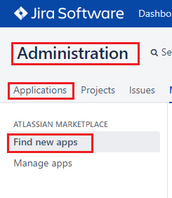
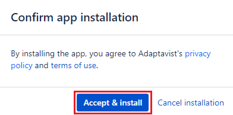
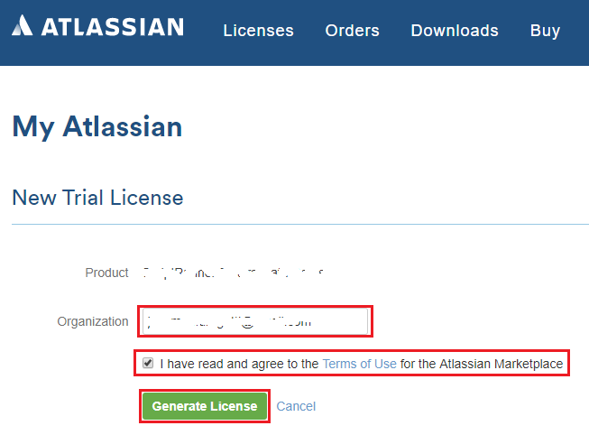
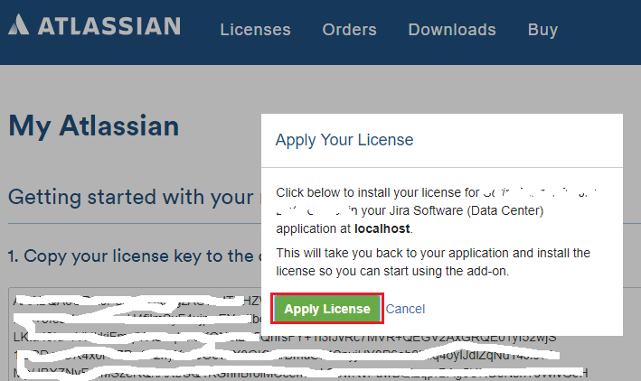
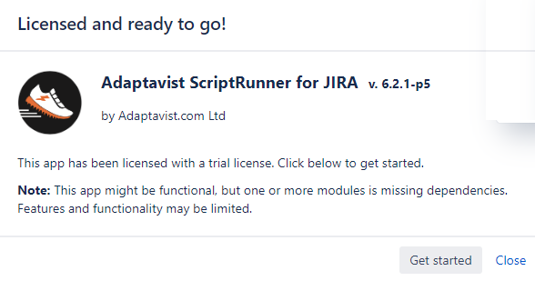

## install-Script-Runner-for-Jira-Server-Step-by-Step

### Step 01: Efetue login no Jira com conta de administrador e acesse a administração de aplicações

* Login no Jira com a url de serviço. Ex: `http://localhost:8080/`
* Clique no dropdown menu `Configuração >> Jira Administration >> Applications`

 

* Clique no menu lateral esquerdo `Administração >> Applications >> Find new apps`

 

* Preencha o campo de filtro `Search the Marketplace` com a informação `Script Runner for Jira` e aplique a consulta

 

* Clique sobre o link `Free Trial` na linha correspondente a `ScriptRunner for Jira`

 

* Confirme a instalação e você será redirecionado ao `My Atlasian` get trial license

 
 

* Confirme a Organização e Termos de Uso e aplique a sua licença

 
 
 

* Execute a reindexação