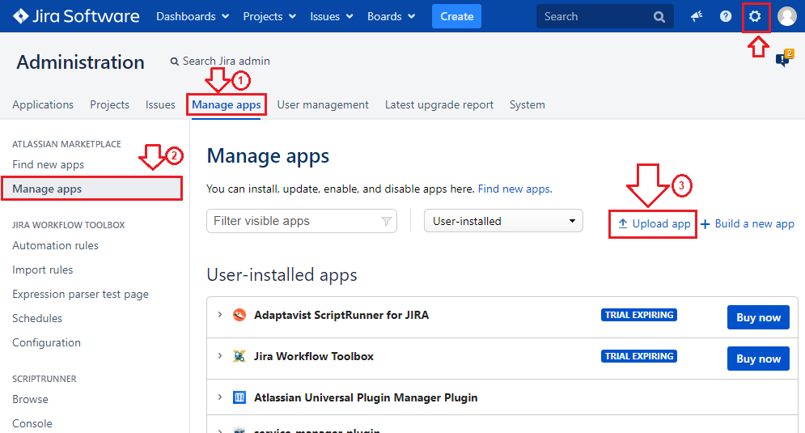
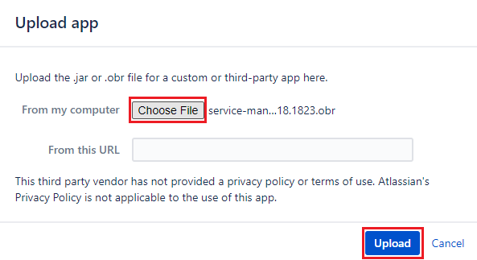
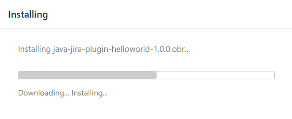
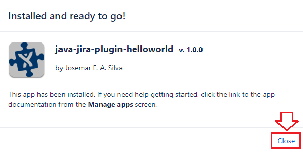
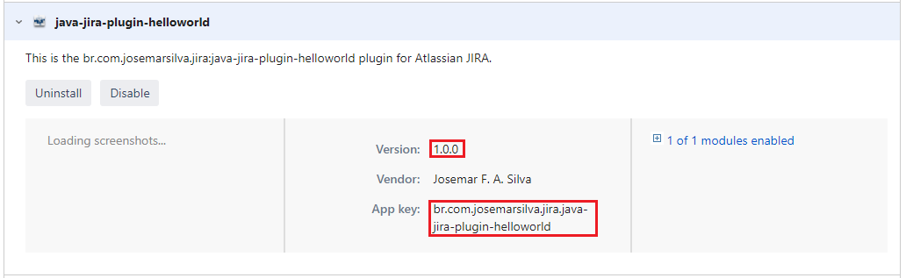
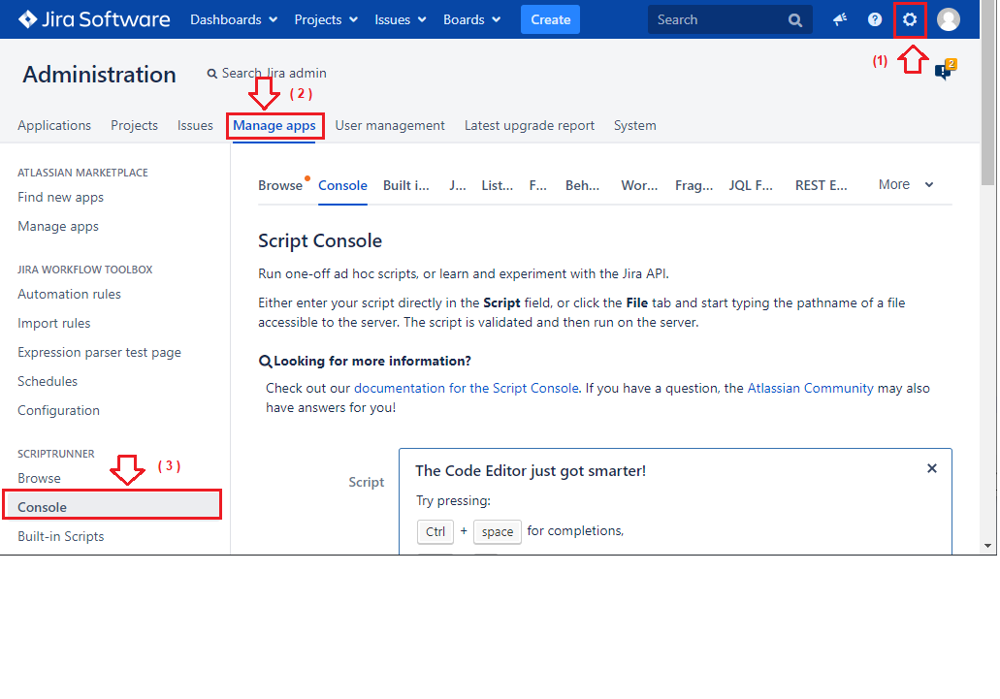
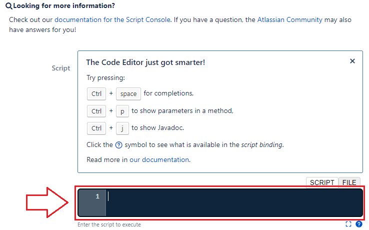
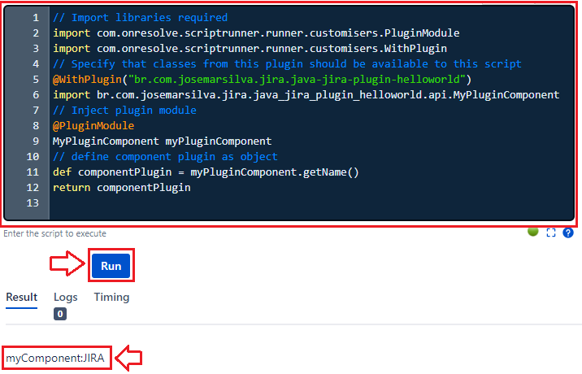

### install-user-custom-plugin-package-generated-by-atlassian-sdk-into-jira.md

1. Localizar o pacote do plugin, seus principais atributos e entender seu comportamento

1.1. Localizando o pacote com extensão `(.obr)`

```cmd
C:\..\java-jira-plugin-helloworld> dir .\target\java-jira-plugin-helloworld*
```

```console
	:
19/06/2020  12:02         1.739.984 java-jira-plugin-helloworld-1.0.0-tests.jar
19/06/2020  12:02           272.246 java-jira-plugin-helloworld-1.0.0.jar
19/06/2020  12:02           238.478 java-jira-plugin-helloworld-1.0.0.obr
	:
```

1.2. Identificando o nome e tributos de registros do plugin-helloworld

```cmd
C:\..\java-jira-plugin-helloworld> type pom.xml | findstr "<name>"
C:\..\java-jira-plugin-helloworld> type pom.xml | findstr "<description>"
```

```console
        <name>Josemar F. A. Silva</name>
    <name>java-jira-plugin-helloworld</name>
	:
    <description>This is the br.com.josemarsilva.jira:java-jira-plugin-helloworld plugin for Atlassian JIRA.</description>
```

1.3. Identificando o comportamento do plugin

* Vejamos o código que o **Atlassian SDK** gerou

```cmd
C:\..\java-jira-plugin-helloworld> dir src\main\java\br\com\josemarsilva\jira\java_jira_plugin_helloworld\*.java /s
```

```console
	:
19/06/2020  10:34               132 MyPluginComponent.java
	:
19/06/2020  10:34             1.061 MyPluginComponentImpl.java
	:
```

* Analisando melhor o plugin construído, ele tem uma classe de interface `api` e outra classe de implementação `impl`

```cmd
C:\..\java-jira-plugin-helloworld> type src\main\java\br\com\josemarsilva\jira\java_jira_plugin_helloworld\api\MyPluginComponent.java
		:
package br.com.josemarsilva.jira.java_jira_plugin_helloworld.api;
public interface MyPluginComponent
{
    String getName();
}
		:
```

```cmd
C:\..\java-jira-plugin-helloworld> type src\main\java\br\com\josemarsilva\jira\java_jira_plugin_helloworld\impl\MyPluginComponentImpl.java
		:
package br.com.josemarsilva.jira.java_jira_plugin_helloworld.impl;
		:
@ExportAsService ({MyPluginComponent.class})
@Named ("myPluginComponent")
public class MyPluginComponentImpl implements MyPluginComponent
{
    @ComponentImport
    private final ApplicationProperties applicationProperties;

    @Inject
    public MyPluginComponentImpl(final ApplicationProperties applicationProperties)
    {
        this.applicationProperties = applicationProperties;
    }

    public String getName()
    {
        if(null != applicationProperties)
        {
            return "myComponent:" + applicationProperties.getDisplayName();
        }

        return "myComponent";
    }
}
		:
```

* Seu plugin tem uma classe de interface `api` e outra classe de implementação `impl`. 
* Sua classe de interface implementa o método `getName()`
* Sua classe de implementação retorna o string `myComponentMyPlugin`


2. Instalando o plugin customizado pelo Atlassian SDK no Jira

2.1. Efetue o login no Jira com credenciais de administração
2.2. Navegue para o menu `Configuração >> Jira Administration >> Manage Apps`
2.3. Na página de `Administration` clique na aba de menu superior `Manage Apps`, em seguida no botão lateral esquerdo `Manage App` e em seguida link `Upload app`

 

2.4. Na caixa de diálogo `Upload app` clique no botão `Choose file` e informe a localização do arquivo (.obr) com o binário de seu plugin `C:\..\java-jira-plugin-helloworld\target\java-jira-plugin-helloworld\java-jira-plugin-helloworld-1.0.0.obr` e em seguida clique no botão `Upload`

 

2.5. Aguarde a instalação do Plugin pelo Jira

 
 

2.6. Observe que o seu plugin customizado pelo Atlassian SDK agora faz parte desta instalação do Jira

* Clique no link para expandir a visualização e ter acesso aos detalhes de registro do plugin no Jira
  * Versão: `1.0.0`
  * App Key: `br.com.josemarsilva.jira.java-jira-plugin-helloworld`

 

3. Executando o plugin customizado pelo Atlassian SDK no Jira pela Console do ScriptRunner

3.1. Na página de `Administration` clique na aba de menu superior `Manage Apps`, em seguida no botão lateral esquerdo `Console`

 

3.2. Na página de `Script Console` localize o campo `Enter the script to Execute` e o botão `Run`. Nos próximos passos você deverá colocar trechos de scripts no campo co o script e clicar no botão `Run` para executar os scripts. Como resultado irá aparecer uma região de resultados identificada por `Result`, uma região de `Logs` onde são registrados os debug's da aplicação e uma região de métricas de execução `Timing` 

 

3.3. Na página de `Script Console` entre com o seguinte script para executar

* Lembre-se dos atributos registrados de seu plugin e `Configuração >> Jira Administration >> Manage Apps`
  * Versão: `1.0.0`
  * App Key: `br.com.josemarsilva.jira.java-jira-plugin-helloworld`
* Lembre-se do código fonte da _interface_ e da _ implementação_ no Atlassian SDK
  * `MyPluginComponent.java`: `... String getName(); ...`
  * `MyPluginComponentImpl.java`: `... return "myComponent:" + applicationProperties.getDisplayName(); ...`


```groovy
// Import libraries required
import com.onresolve.scriptrunner.runner.customisers.PluginModule
import com.onresolve.scriptrunner.runner.customisers.WithPlugin
// Specify that classes from this plugin should be available to this script
@WithPlugin("br.com.josemarsilva.jira.java-jira-plugin-helloworld")
import br.com.josemarsilva.jira.java_jira_plugin_helloworld.api.MyPluginComponent
// Inject plugin module
@PluginModule
MyPluginComponent myPluginComponent
// define instance for plugin component
def componentPlugin = myPluginComponent.getName()
```

* Em seguida clique no botão `Run` para executar
* Observe o resultado na aba `Result`: Ele é o código desenvolvido que mostra "myComponent" + o nome da aplicação da atlassian "JIRA"

```console
myComponent:JIRA
```

 

